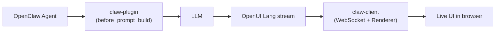

<div align="center">

<!-- Replace with hosted banner when available -->
<!--  -->

# OpenClaw UI — Generative UI for OpenClaw

[](https://github.com/thesysdev/openclaw-ui/actions/workflows/build.yml)
[](./LICENSE)
[](https://discord.com/invite/Pbv5PsqUSv)

</div>

OpenClaw UI is the **OpenClaw integration for [OpenUI](https://openui.com)** — a server-side plugin and a streaming web client that turn any OpenClaw agent's responses into live, interactive UI: charts, tables, forms, dashboards, cards. Instead of plain markdown, agents emit structured [OpenUI Lang](https://openui.com), and the client renders it as React components in real time.

---

[Docs](https://openui.com) · [OpenUI Playground](https://www.openui.com/playground) · [OpenClaw](https://github.com/openclaw/openclaw) · [Discord](https://discord.com/invite/Pbv5PsqUSv) · [Contributing](./CONTRIBUTING.md) · [Code of Conduct](./CODE_OF_CONDUCT.md) · [Security](./SECURITY.md) · [License](./LICENSE)

---

## What is OpenClaw UI?

<!-- Add demo gif here:
<div align="center">
  
</div>
-->

OpenClaw UI is a two-part system that adds generative UI to any OpenClaw agent:

- **`@openuidev/openclaw-ui-plugin`** — an OpenClaw server-side plugin that detects Claw sessions and injects an OpenUI Lang system prompt into the agent's context, so the LLM responds with structured UI markup instead of text.
- **`@openuidev/claw-client`** — a Next.js web client that connects to your OpenClaw gateway over WebSocket and renders agent responses as live, interactive components using the OpenUI React renderer.

**Core capabilities:**

- **Drop-in plugin** — Install once into your OpenClaw gateway; works for every agent.
- **Session-scoped activation** — Other clients (CLI, scripts, third-party apps) on the same gateway are unaffected.
- **Streaming renderer** — Components render progressively as the LLM streams tokens.
- **Built on OpenUI Lang** — Up to 67% more token-efficient than equivalent JSON output.
- **Apps, artifacts, notifications, uploads** — Persistent, addressable UI primitives backed by the plugin.
- **No build step for the plugin** — OpenClaw loads it as raw TypeScript via [jiti](https://github.com/unjs/jiti).

---

## Quick Start

### 1. Clone and install

```bash
git clone https://github.com/thesysdev/openclaw-ui.git
cd openclaw-ui
pnpm install
```

### 2. Install the plugin into your OpenClaw gateway

```bash
openclaw plugins install -l ./packages/claw-plugin
openclaw restart
```

### 3. Start the client

```bash
cd packages/claw-client
pnpm dev   # http://localhost:18790
```

Open the URL, paste your gateway URL and auth token into settings, and start chatting. Agent responses now render as live, interactive UI.

> Need your gateway URL and token?
> ```bash
> node scripts/connection-info.mjs
> ```
> reads them from `~/.openclaw/openclaw.json`.

---

## How it works



1. The Claw client opens a session with the gateway using a key suffixed with `:openclaw-ui`.
2. On each agent run, `claw-plugin`'s `before_prompt_build` hook detects the suffix and prepends the OpenUI Lang system prompt.
3. The LLM streams structured component markup back over the gateway protocol.
4. `claw-client` parses the stream and renders the components progressively into the chat surface.

Sessions from any other client on the same gateway are not modified.

See [`AGENTS.md`](./AGENTS.md) for the full protocol, the plugin detection mechanism, and the agent / session / thread mental model.

---

## Packages

| Package | Description |
| :--- | :--- |
| [`@openuidev/openclaw-ui-plugin`](./packages/claw-plugin) | OpenClaw server-side plugin. Injects the OpenUI Lang system prompt and provides app, artifact, notification, and upload stores. |
| [`@openuidev/claw-client`](./packages/claw-client) | Next.js web client. Connects to the gateway over WebSocket and renders agent output as live components. |

Both packages live in this monorepo and are linked via pnpm workspaces. They are versioned together for now.

---

## Repository structure

```
openclaw-ui/
├── packages/
│   ├── claw-client/      # Next.js generative UI web client
│   └── claw-plugin/      # OpenClaw server-side plugin (single .ts entry)
├── scripts/              # Local helpers (connection info, tunnel setup)
├── .github/              # CI workflows + issue / PR templates
├── AGENTS.md             # Protocol and mental-model deep dive
├── CONTRIBUTING.md       # Development workflow
└── README.md             # You are here
```

Good places to start:

- [`packages/claw-client`](./packages/claw-client) — the web app
- [`packages/claw-plugin`](./packages/claw-plugin) — the OpenClaw plugin
- [`AGENTS.md`](./AGENTS.md) — gateway protocol & session model
- [`CONTRIBUTING.md`](./CONTRIBUTING.md) — local setup, code style, PR workflow

---

## Scripts

Run from the repo root — every script fans out across the workspace.

```bash
pnpm build         # build every package
pnpm lint          # ESLint check across packages
pnpm lint:fix      # ESLint auto-fix
pnpm format        # Prettier check
pnpm format:fix    # Prettier write
pnpm typecheck     # tsc --noEmit across packages
pnpm test          # Vitest across packages
pnpm ci            # full lint + format + typecheck + build (matches CI)
```

---

## Why OpenUI Lang?

OpenUI Lang is designed for model-generated UI that needs to be both structured and streamable.

- **Streaming output** — Emit UI incrementally as tokens arrive.
- **Token efficiency** — Up to 67% fewer tokens than equivalent JSON.
- **Controlled rendering** — Restrict output to the components you define and register.
- **Typed component contracts** — Define component props and structure up front with Zod schemas.

See the [OpenUI documentation](https://openui.com) and [token efficiency benchmarks](https://github.com/thesysdev/openui#token-efficiency-benchmarks) for details.

---

## Documentation

- [openui.com](https://openui.com) — OpenUI Lang reference, component library, and renderer docs
- [`AGENTS.md`](./AGENTS.md) — OpenClaw protocol, plugin detection, session model
- [`packages/claw-client/README.md`](./packages/claw-client/README.md) — client setup, env, deployment
- [`packages/claw-plugin/README.md`](./packages/claw-plugin/README.md) — plugin install, prompt regeneration

---

## Community

- [Discord](https://discord.com/invite/Pbv5PsqUSv) — Ask questions, share what you're building
- [GitHub Issues](https://github.com/thesysdev/openclaw-ui/issues) — Report bugs or request features
- [GitHub Discussions](https://github.com/thesysdev/openclaw-ui/discussions) — Longer-form questions and ideas

---

## Contributing

Contributions are welcome. See [`CONTRIBUTING.md`](./CONTRIBUTING.md) for the local setup, the code-style rules, and the pull request workflow.

## License

This project is available under the terms described in [`LICENSE`](./LICENSE).
